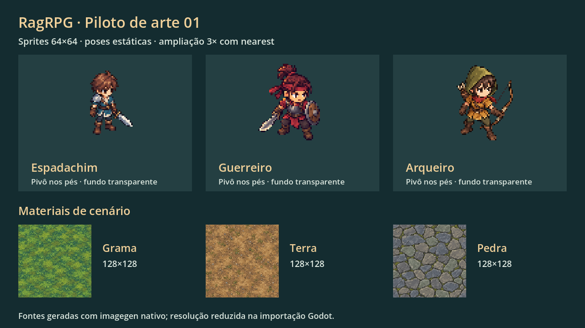
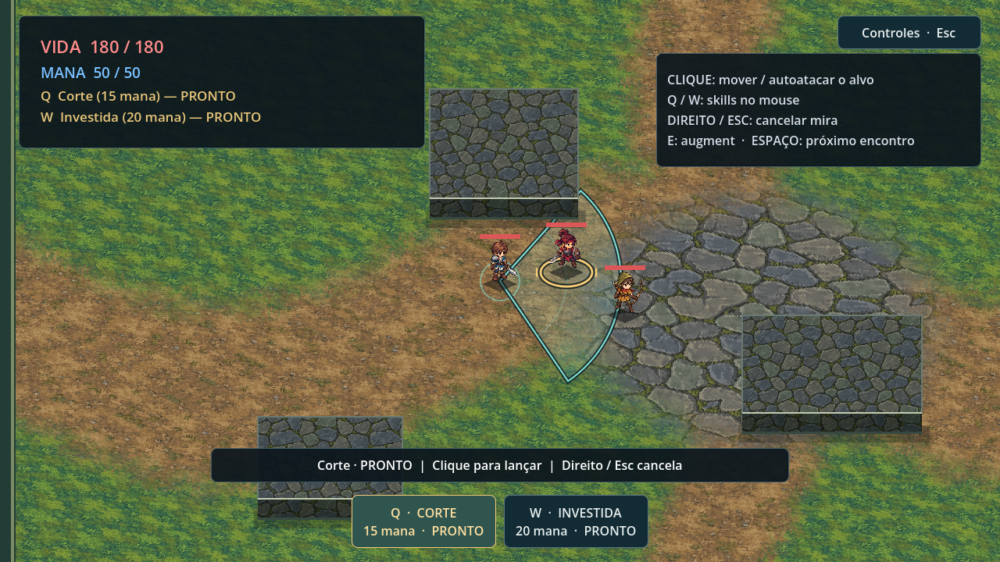

# Playtest — mira, feedback de combate e piloto visual 01

Base: `21c6473` (correções revisadas de cone e auto), com UI anterior `c771d76`.
Implementação: `codex/art-pilot`. Master aceito continua `e70e4d4`.
Abrir o projeto habitual, aceitar recarregamento se o editor solicitar e rodar F5.
Parar a partida anterior para carregar o novo candidato; nenhuma operação Git é
necessária para o usuário.

## O que mudou

- O cone usa a direção do cursor mesmo além do alcance. Seu efeito mantém a origem
  e orientação do lançamento quando movimento ou auto mudam a direção do jogador.
- O arco de auto chega ao alvo dentro do alcance válido; o raio fixo anterior de
  62 unidades ficava visualmente curto. Um erro de precisão mostra `ERROU` sem
  flash de acerto. As fórmulas, chances e distâncias de combate foram preservadas.
- Espadachim, guerreiro e arqueiro têm sprites originais de fantasia cartunesca,
  com corpo compacto, roupas simples e cores distintas. Guerreiro substitui apenas
  o visual e nome apresentado do arquétipo interno `chaser`.
- Grama, terra e pedra se misturam em trilhas e uma pequena praça. Obstáculos têm
  faces de pedra e se sobrepõem aos atores conforme a posição no chão.

## Arquivos e decisões de arte

`assets/art/pilot/{hero,warrior,archer,grass,dirt,stone}.png` são as fontes geradas.
Seus `.png.import` reduzem os personagens a **64×64** e materiais a **128×128**.
O PNG fonte tem resolução maior: a dimensão lógica é aplicada pela importação Godot.
Os sprites preservam alpha e usam nearest. A altura aparente é normalizada em 52
unidades; a célula contém margens distintas, e elas não alteram a hitbox.

64×64 já preservou cabelo, arma, armadura e distinção dos três arquétipos no piloto.
É o ponto inicial recomendado, sujeito ao playtest; comparar 48/80 antes de produzir
as animações finais se rosto ou equipamentos precisarem de outra densidade.

Prompts completos e método: [ART_PROMPTS_PILOT.md](ART_PROMPTS_PILOT.md).
As seis chamadas usaram imagegen nativo; originais externos foram preservados.
As capturas abaixo foram renderizadas pelo próprio Godot com os assets importados.

## Validação e aceite

`tools/verify.ps1` completo no worktree de arte: importação, 221 checks de fundação,
combate, perseguição, input/UI, fluxo e layout, mais inicialização da cena.
Renderização com Compatibility/OpenGL na GTX 1080 conferiu shader, transparência,
escala, HUD e mira. Texturas carregadas no runtime: sprites 64×64 com alpha;
materiais 128×128 opacos. Isso não substitui medição de FPS em partida real.

Roteiro sugerido:

1. Andar para um lado, selecionar Q, apontar longe na direção oposta e clicar.
   Conferir a mira, o arco e quais inimigos perdem HP.
2. Selecionar um guerreiro e deixar o auto agir: número de dano/HP perdido nos
   acertos, `ERROU` nos erros. Testes com RNG confirmaram dano e eliminação do melee
   em 30/60/144 Hz, em ambas as ordens de atualização; o relato de falha mecânica
   não foi reproduzido nesses cenários.
3. Conferir clareza dos sprites, pés/anéis, tamanho dos corpos e leitura dos pisos.
   Chegar ao segundo encontro para ver os arqueiros com o novo visual.

## Limites concretos e próximo passo

- Uma pose estática por personagem; ainda não há caminhada, oito direções ou
  animações completas de ataque. Contato visual usa os efeitos de combate existentes.
- Fontes geradas reduzidas pelo importador ainda precisam de limpeza de pixels e
  uniformização antes de servirem como referência para todos os frames finais.
- Piso e obstáculos continuam 2D. A prova de chão 3D ortográfico com sprites 2D
  está descrita em `ART_DIRECTION_NEXT.md`; migração não foi iniciada.
- Mistura por shader e repetição espelhada suavizam emendas, mas padrões repetidos
  continuam visíveis. Kit com variações, cantos e transições pintadas é um próximo bloco.
- Gelo e conservação de momento no gelo permanecem futuros.
- No diretório habitual, a importação de um segundo editor pode encontrar a DLL do
  GitPlugin ocupada pelo editor do usuário. Validar importação no worktree limpo;
  usar `-SkipEditorImport` no diretório habitual apenas para repetir os testes de
  runtime. Preservar GitPlugin, `project.godot`, `build/` e `export_presets.cfg` locais.

Após aceite visual deste candidato, registrar merge em master. Só então definir
com o usuário o próximo bloco de animação ou a prova técnica de chão 3D.
