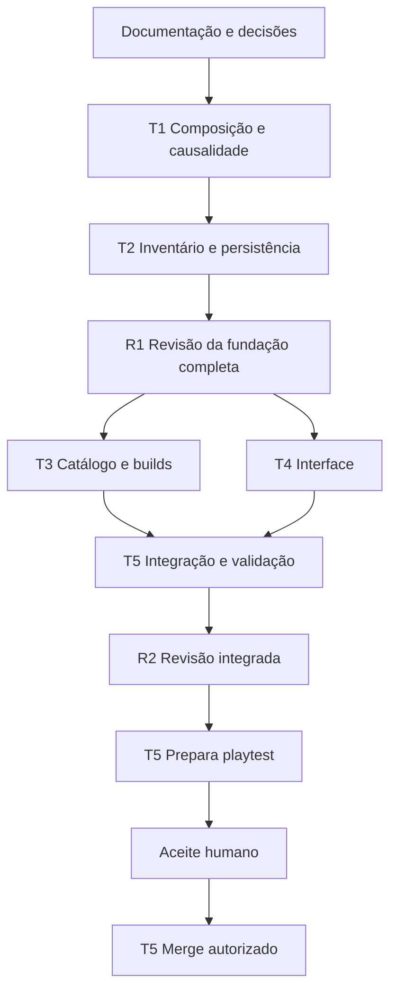

# E06 — tarefas temporárias e mapa de integração

09/10/2026. Contrato: [e06_contract.md](e06_contract.md).
Retomada: [e06_checkpoint.md](e06_checkpoint.md).
**Nenhum executor criado nesta rodada.** D1/D2/D3 respondidas.
T1 pronta para dispatch pela coordenação após o commit documental; outras
tarefas aguardam entregas técnicas, não novo aceite humano rotineiro.

## Bases e registros

- B0: `51b5fabc8fcc7bb74f1b45479cdfe1aa090be4bc`, candidato auditado.
- D0: entrega documental marcada por `codex/e06-architecture-docs-v1`.
- F1: commit T1 entregue/validado, usado como base de T2.
- F2: composição T1+T2, aprovada em R1; base comum congelada de T3/T4.
- I0: F2+T3+T4 integrados e validados por T5.
- P0: candidato exato aprovado em R2 e aplicado ao playtest por T5.
- M0: merge após aceite explícito do usuário sobre P0.

F1/F2/I0/P0/M0 ainda não existem. Antes de dispatch, resolver D0 ou dependência
em SHA completo e registrar branch, checkout absoluto, chat_id e dono dos arquivos.
Não executar a partir de referência planejada nem usar B0 sem os novos contratos.

Checkout documental existente:
`C:/Users/João Pedro/.codex/worktrees/e06-architecture/RagRPG`,
branch `codex/e06-architecture`, exclusivo do chat permanente.
Executores usam worktrees gerenciadas próprias, ainda não criadas; nomes de
branches abaixo são propostas. Preservar diretório fixo, save e branches alheias.

Cada tarefa cria seu registro exclusivo em `docs/epics/e06/e06_t1.md`,
`e06_t2.md`, `e06_t3.md`, `e06_t4.md`, `e06_t5.md` ou `e06_r.md`.
Checkpoint central: coordenação é dona até transferi-lo a T5.
Hash/evidência/limitação não podem existir somente na conversa que será arquivada.
Mensagens entre chats continuam dependentes da autorização humana correspondente.

## DAG: seis chats, duas etapas da mesma revisão



R1/R2 pertencem ao mesmo chat temporário R, mantido pendente entre etapas.
São revisão de uma fundação crítica completa e do candidato integrado, sem gate
por microtarefa. O chat permanente não executa R, integração ou gerência contínua.
T5 mantém a responsabilidade operacional durante playtest/correções/aceite.

| ID | Resultado | Modelo / esforço propostos | Base / branch / checkout |
|---|---|---|---|
| T1 | Composição única e causalidade limitada, adaptadas ao runtime | gpt-6.1-sol / xhigh | D0; codex/e06-effects; worktree própria a criar |
| T2 | Coleção, troca, cartas e recompensas atômicas | gpt-6.1-sol / xhigh | F1; codex/e06-inventory; worktree própria a criar |
| R | Parecer independente R1/R2 | gpt-6-astra / high; xhigh se necessário pela complexidade real | T1+T2 em R1; I0 em R2; codex/e06-review; checkout próprio |
| T3 | Catálogo concreto e duas builds legais por identidade | gpt-5.6-terra / high | F2 aprovado; codex/e06-content; checkout próprio |
| T4 | Ofertas/inventário/previews utilizáveis | gpt-5.6-terra / high | F2 aprovado; codex/e06-build-ui; checkout próprio |
| T5 | Candidato, evidências, playtest e eventual merge autorizado | gpt-6.1-sol / high | F2 + T3/T4; codex/e06-integration; checkout próprio |

Modelo/esforço são escolhas explícitas na criação/rodada, não adaptação automática.
Luna pode preencher variantes estritamente fechadas dentro de T3 após receita/
validador, com arquivos exclusivos e conferência Terra. Não criar um chat extra
por texto, função ou variante, nem passar a entrega pelos quatro modelos.

## Propriedade exclusiva

Novos caminhos são propostas; T1 publica nomes/assinaturas finais no manifesto
de API. Renomeação interna equivalente é rotina; mudança semântica exige delta
contratual antes dos consumidores. Toda transferência de dono é registrada.

| Arquivos/conjunto | Dono |
|---|---|
| scripts/core/damage_request.gd, combat_math.gd; novos combat_event_context.gd, effect_proc_ledger.gd | T1; T5 somente após transferência para integração |
| scripts/core/stat_calculator.gd, build_snapshot.gd, run_state.gd; scripts/actors/player_actor.gd; scripts/main.gd | T1 → T2 → T5, sequencialmente |
| scripts/core/health_state.gd e escritores de HP/SP; eventual componente de déficit | T1 apenas causalidade → T2 recursos → T5 integração |
| scripts/data/augment_definition.gd; novos equipment_definition.gd, card_definition.gd, effect_definition.gd; scripts/core/build_effect_catalog.gd, build_effect_composer.gd, skill_effect_resolver.gd | T1; T2/T3/T4 consomem, não editam sem transferência |
| scripts/core/profile_catalog.gd, profile_facade.gd, profile_codec.gd, profile_store.gd, profile_state.gd, profile_reward_resolver.gd | T2 |
| novos scripts/core/run_build_service.gd, run_card_inventory.gd, run_reward_service.gd, build_presentation.gd; scripts/world/reward_pickup.gd | T2 |
| resources/build_effects/** | T2 cria metadata/IDs fixados em §8 → T3 preenche conteúdo depois de R1 |
| assets/art/icons/build_effects/**, docs/epics/e06/content_manifest.md | T3 |
| scripts/ui/character_menu.gd; novos scripts/ui/build_inventory_panel.gd, augment_choice_panel.gd; scenes/ui/e06/** | T4 |
| tests/e06_effects_*, tests/e06_proc_* | T1 |
| tests/e06_inventory_*, e06_rewards_*, e06_migration_* | T2 |
| tests/e06_content_* e fixtures próprias | T3 |
| tests/e06_ui_* e fixtures próprias | T4 |
| tests/e06_integration_*, tools/e06_*_probe.gd, scenes/diagnostics/e06_* | T5 |
| tools/verify.ps1 | T1 → T2 → T5; T3/T4 entregam lista de testes/comandos sem disputar o runner |
| docs/epics/e06/e06_r.md, tests/e06_review_* | R; revisor não corrige runtime que vai aprovar |

T1 inventaria os outros produtores/consumidores de DamageRequest em projéteis,
DoTs e estados E05, registra lista exata e assume exclusividade antes de editar.
T2 faz o mesmo para escritores de recursos. Não conceder scripts/** inteiro
como propriedade implícita. Testes legados afetados também entram nessa lista.
Nenhuma tarefa paralela começa com arquivo compartilhado ainda sob alteração.

T4 constrói painéis desacoplados e testa com hospedeiro/fixtures próprios;
a conexão em Main fica com T5. T3 usa carregador pronto, sem editar ProfileCatalog
para registrar seus dados. Handler adicional solicitado por T3 retorna a T1,
suspendendo receitas dependentes e revalidando F2/consumidores afetados.

## T1 — composição e causalidade

**Resultado observável:** a mesma fonte em augment/equipamento/carta compõe de
modo previsível e preview coincide com execução; efeitos concorrentes respeitam
raiz/família/teto 16. Cinco augments preservam IDs e comportamento válido.

**Inclui/APIs:** BuildEffectCatalog/Composer, SkillEffectResolver, contexto/ledger,
tipos/validação/conflitos, snapshot por emissão, adaptadores dos efeitos existentes
e primitivas de oferta/confirmar/esgotar no RunState. Publicar manifesto
origem→adaptador→consumidor com assinaturas, erros e fixtures por valor.
Consome StatCalculator, CombatMath, HealthState, ClassCatalog e contratos E05.
Fixtures mínimas provam transformação nas três origens sem conceder itens reais.

**Exclusões:** inventário/save, tuning completo, UI final, campanha, novos kits,
alterar números das classes ou habilitar identidades indisponíveis.

**Teste/aceite:** fontes reordenadas/duplicadas; caps e conflitos; preview/execução;
snapshots após mudança; 16/17, multi-alvo/projétil/tick, evento tardio, reentrada,
miss/zero/escudo/letal, pausa/morte/remoção e exceções legais E05. Regressões dos
consumidores existentes e tools/verify.ps1 completo (runtime compartilhado).

**Conclusão:** commit limpo, APIs/arquivos finais e evidências registradas.
T2 integra/reproduz F1 antes de usar. Aprovação independente do conjunto T1+T2
vem em R1; arquivável após F2 validado/aprovado, mantendo correções no chat T1.

## T2 — inventário, cartas e durabilidade

**Resultado observável:** coleta salva item; trocar/encaixar altera somente a
build permitida; falha ou déficit extremo conserva perfil e ator; morte/reabrir
conserva itens/XP e descarta cartas/augments.

**APIs:** consome T1; entrega RunBuildService preview/commit, RunCardInventory,
RunRewardService, DTOs BuildPresentation e operação restrita da ProfileFacade.
Coleção/menu, mochila/run, comparação, ofertas e erros têm fixtures prontas para
T3/T4. Não expor estado mutável interno nem bool da UI como autorização de encontro.

**Inclui:** ledger de déficits e auditoria dos escritores HP/SP; carta única/
encaixes por item; presets/alts; metadata de item por catálogo único; migração
aditiva/starters e metadata dos IDs reservados em §8; reward seq/payload estáveis; terminal demonstrativo do piloto;
wiring mínimo em Main/Player para testes. Dados finais e UI pertencem a T3/T4.

**Exclusões:** UI final, campanha, novos números de XP, fórmulas/skills e avanço
de catálogo sem mapa explícito de migração.

**Teste/aceite:** trocas positivas/extremas/repetidas; buff/regen/custos; combate,
origem/slot/posse/handler, conflitos, replay/stale; disco/memória antes/depois;
falhas em estágios de escrita e resultado incerto; versões/pending/backup
preservados; migrações suportadas sem dupla conversão de stats; alts independentes;
snapshot/ranks/barras24; carta livre/encaixada/transferida e reset transitório.
Verify completo, saves em fixtures explícitas.

**Conclusão:** candidato completo T1+T2, manifesto de DTOs/APIs estável e commit
limpo. R1 reproduz/aprova F2 antes de T3/T4. Arquivável após F2 integrado/validado.

## R — revisão independente

**Resultado observável:** parecer reproduzível com SHA/árvore exatos, achados,
decisão e limites, distinguindo inspeção, evidência do autor e reprodução própria.

**R1:** fundação T1+T2 completa: matemática/composição, causalidade/quotas,
adaptadores E05, identidade, troca/dívida, migração e falhas de save, APIs dos
consumidores. Casos adversariais independentes e verify completo. Aprovar F2 ou
devolver achados às tarefas autoras, sem exigir gate para cada commit interno.

**R2:** I0: delta catálogo/UI/integração, dez identidades/20 builds, combinações
das três origens, renderer, terminal/reload e validade dos contratos de R1.
Reproduzir suíte integral e inspecionar capturas próprias/renderer. Reuso de
evidência só com inputs compatíveis e identificado; nunca converter evidência
do implementador em reprodução própria.

**APIs/donos:** consome somente leitura todos os serviços; entrega approved/rejected
com hash, seleção, engine, achados e limites. Escreve só relatório/testes próprios.

**Exclusões/conclusão:** não corrige runtime, não publica, não faz merge/gerência.
Fica pendente entre R1/R2; arquivável após R2 registrado e P0 aplicado/validado.
Autoria do contrato pelo chat permanente não conta como review de executável.

## T3 — catálogo e builds

**Resultado observável:** pools gerais/origem/exclusivos úteis para dez identidades;
equipamentos/cartas transformadores; duas builds legais/identidade mudam uma
decisão de combate, além de diferenças numéricas.

**APIs/entrega:** Resources sobre F2, manifesto de IDs/ranks mínimos/curvas/unidades/
caps/conflitos/alvos/eligibilidade, ícones sobre padrão existente, duas builds/
identidade e tabela de recompensa demonstrativa. Sem alterar carregador/serviços.

**Inclui:** cinco IDs piloto; lote inicial 12 equipamentos/6 cartas; pelo menos
duas opções exclusivas por evolução disponível, direção de §8 do contrato e
herança compatível com biblioteca/auto. Tuning explícito é trabalho de conteúdo;
cada origem (augment/item/carta) demonstra transformação funcional conforme D2.

**Exclusões:** handlers/serviços/migração, UI, arte de personagem, cinco híbridas
bloqueadas. Receita além dos eixos/handlers existentes espera extensão contratual;
não substituir a fantasia silenciosamente por um bônus de atributo.

**Teste/aceite:** manifesto de quantidades reais, curvas e recursos válidos,
matriz 10 positivas/5 negativas, oferta útil/cap/esgotamento, conflitos das três
origens,20 builds por APIs e transformações observáveis. Testes dirigidos,
comandos/lista para T5 registrar em verify.

**Conclusão:** commit limpo com receitas e evidências; arquivável após integração
T5/R2 validada. Paralelo com T4 sobre F2; sem mudanças de API durante esse paralelo.

## T4 — interface de coleção, inventário e ofertas

**Resultado observável:** usuário distingue persistente/temporário, compara
atual→próximo/antes→depois, escolhe/equipa/transfere e entende bloqueios; nenhum
clique duplicado, lançamento de skill ou reroll por reabrir UI.

**APIs/entrega:** apenas DTOs/operações F2; catálogo injetado. Fixtures próprias
com três origens transformadoras, caps e nomes longos, independentes do T3.
Painéis e integração CharacterMenu; sinais para ligação Main por T5.

**Exclusões:** Main/Player, fórmulas/elegibilidade própria, persistência,
handlers, catálogo final e política de loot.

**Teste/aceite:** renderer, teclado/mouse,1280×720/1080p, ofertas0/1/2/3,
pendências acumuladas, fechar/reabrir, falha/retry, carta única/transferência,
conflito/restrições, pausa/foco e sem input vazando. Testes e06_ui_* e capturas
identificados; comandos e evidências completos.

**Conclusão:** commit limpo, contrato de sinais/integração e registros; arquivável
após T5/R2 validar integração. Não editar runner ou arquivos de conteúdo em paralelo.

## T5 — composição, validação e operação

**Resultado observável:** candidato único do piloto com dez identidades,
inventário/ofertas/transformações e evidências ligadas ao commit; playtest e
merge somente nos gates correspondentes.

**APIs/arquivos:** integra F2+T3+T4 serialmente, conecta painéis/dados em Main/Player,
registra testes em verify e assume checkpoint mediante transferência.
Wiring local pode ser corrigido aqui; defeito de domínio retorna ao autor,
reabrindo seu chat se necessário. Não criar API concorrente.

**Inclui/teste:** tools/verify.ps1 completo e nova seleção conferida;20 builds,
5 identidades bloqueadas, fontes combinadas, três chamadas de etapa em fixture,
esgotamento/fim do piloto, alts/restart/morte/abandono, emissores em voo,
recursos/custos/buffs.30/60/144 nas novas interações de tempo; renderer de
inventário/oferta/transformações/casos densos, sem alegar FPS. Logs sem ERROR,
SCRIPT ERROR ou rotina incompleta; roteiro humano curto.

**Exclusões:** novos épicos/skills, save pessoal em testes, aceite de balanceamento
inferido, playtest antes de R2 e merge/push sem autorização.

**Conclusão técnica:** entregar I0 limpo a R2, corrigir/reintegrar/revalidar deltas.
Rebase/conflito não herda evidência incompatível. Após R2, preparar/aplicar P0 no
diretório fixo, registrar hash/import/smoke; aguardar playtest humano. Após aceite
explícito de P0, integrar M0 sem trocar a branch do Godot. Arquivável após terminar
os passos autorizados, com registro e limitações; pendência humana mantém chat aberto.

## Registro obrigatório por tarefa

```text
ID / estado / chat_id:
Autorização e contrato (commit/caminho):
Executor / modelo / esforço real:
Resultado / exclusões:
Base SHA / branch / checkout absoluto:
Dependências aprovadas (SHA + decisão):
Arquivos exclusivos / transferência de dono:
APIs consumidas/entregues / revisão congelada:
Commit entregue / commit integrado / árvore:
Validação do autor (engine, comando, seleção, contagens, resultado, logs/hash):
Reprodução independente (ou pendente; nunca copiar como própria):
Capturas/artefatos preservados (caminho/hash e modo de reprodução):
Limitações / falhas / decisões humanas:
Critério de conclusão / próximo passo:
Quem validou integração / evidência / data:
Arquivável? motivo / preservação da worktree:
```

“Não iniciado”, “não criado” e “pendente de <dependência>” são estados válidos.
Não inventar SHA, número de checks, PASS ou aceite. Arquivar só após entrega
registrada, validada e integrada. Falha/decisão mantém aberto; correções na mesma
tarefa. Preservar logs ignorados necessários antes de remover uma worktree.
